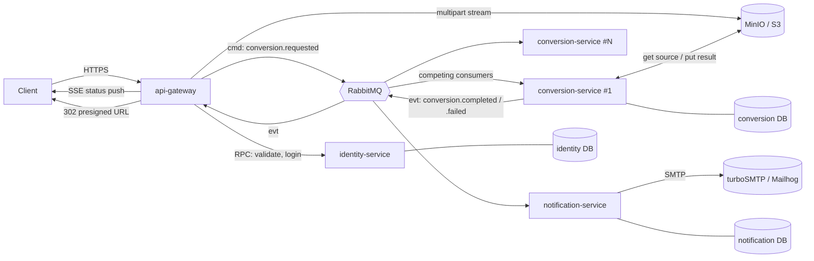

# File Converter — Architecture Proposal

**Status:** draft for mentor approval
**Date:** 2026-09-14
**Base:** this repo (NestJS 11 + Fastify + PostgreSQL boilerplate), converted into a Nest monorepo. The
boilerplate shipped TypeORM; the stack now uses Prisma (README → Database).

---

## 1. Summary

A backend service that accepts a file, converts it to another format asynchronously, and delivers the
result. Four services in one Nest monorepo, talking over RabbitMQ, with S3-compatible object storage
(MinIO locally) holding the bytes.

The core decision: **HTTP requests never do the conversion.** The gateway accepts the file, stores it,
records a job, and returns `202 Accepted` with a job id. Workers consume the job from a queue. This is
what makes the system survive a 200 MB video and a slow LibreOffice run without holding an HTTP
connection open, and it is what gives the microservice split a real reason to exist rather than a
decorative one.

**Decisions still open for you** — the conversion format list (§5.3) and the limits in §12.

---

## 2. Service decomposition

| Service | Responsibility | Owns | Scale driver |
|---|---|---|---|
| `api-gateway` | The only public HTTP surface. Auth guards, rate limiting, multipart intake, presigned download URLs, OpenAPI. Owns no domain data. | — | HTTP concurrency |
| `identity-service` | Registration, login, JWT issuing/refresh, email verification, password reset, user profile. | `identity` DB | low |
| `conversion-service` | Consumes conversion commands, runs the converter engines, writes results to storage. Stateless, N replicas. | `conversion` DB | **CPU / job volume** |
| `notification-service` | Consumes domain events, renders templates, sends SMTP mail. | `notification` DB | low |

**Why this split and not more:** the only component with a genuinely different scaling profile and
resource footprint is the converter — it is CPU-bound, needs heavyweight binaries (ffmpeg,
LibreOffice) in its image, and is the thing you want 5 replicas of when a queue builds up. Splitting
auth out keeps the gateway free of user-table coupling and gives a second, clean example of a
request/response microservice call. Notifications are split because email is slow, flaky, and must not
be able to fail a conversion. Anything finer (a separate "storage-service", a separate "job-service")
would be network hops with no independent reason to exist.

**Database per service.** Each service owns its schema and nobody else reads it — cross-service data
travels only as messages. Locally that is one PostgreSQL container with three databases; in production
they would be three instances. This is the rule a mentor will check first, so it is worth respecting
even where it costs a join.



---

## 3. Repository layout

Nest monorepo mode, in this repository. The existing `src/core/*` modules move to `libs/core` and are
imported by every app unchanged — config, database, health, throttler are all still used.

```
apps/
  api-gateway/            HTTP edge (Fastify) + RMQ client
    src/modules/{auth,users,conversions,formats}/
  identity-service/       RMQ message handlers (request/response)
    src/modules/{auth,users,tokens}/
  conversion-service/     RMQ consumer, no HTTP except /health
    src/modules/{worker,converters,pipeline}/
  notification-service/   RMQ consumer + SMTP
    src/modules/{mailer,templates}/
libs/
  core/                   config, database, health, throttler  (moved from src/core)
  contracts/              message patterns, event payloads, zod schemas, enums, error codes
  storage/                S3/MinIO client: put, get stream, presign, delete
  observability/          pino logger, correlation-id interceptor, metrics
docs/
docker/                   Dockerfile per app + compose stack
```

`libs/contracts` is the only thing every service depends on, and it contains **types and schemas, no
logic** — that is what keeps the services independently deployable. A change there is a contract change
and gets versioned.

### Migration steps from the current boilerplate

1. `nest-cli.json` → monorepo mode, `projects` entries for four apps + four libs.
2. `git mv src/core libs/core`, `src/modules/*` split into the owning apps.
3. `tsconfig.json` paths: `@core/*`, `@contracts/*`, `@storage/*`, `@obs/*`. A per-app `@/*` is **not**
   kept — a single root `tsconfig` cannot map one alias to four different app roots, so within an app the
   imports are relative and only cross-project imports use an alias.
4. Split `main.ts`: gateway keeps the current Fastify bootstrap (compression, cookies, CORS, validation
   pipe, transactional context); workers use `NestFactory.createMicroservice(..., Transport.RMQ)` and a
   tiny HTTP listener for `/health` only.
5. `Config` interface (`libs/core/config`) extended per app — each app validates only the env vars it
   needs, so the conversion worker does not require SMTP credentials to boot.
6. One Prisma schema and one migrations directory **per owning service**; containers run
   `prisma migrate deploy` at start for the local stack, and production migrates as a deploy step.

---

## 4. Messaging design (RabbitMQ)

Transport: `@nestjs/microservices` RMQ. Two interaction styles, deliberately kept distinct:

**Commands — work that must happen exactly once, load-balanced.**

| Exchange | Type | Routing key | Queue | Consumer |
|---|---|---|---|---|
| `conversion.commands` | direct | `convert.<family>` | `conversion.jobs.<family>` | conversion-service |

Routing by format family (`image`, `document`, `av`, `data`) means the ffmpeg workers and the sharp
workers are **separate deployments with separate queues and separate images** — a 40-minute video does
not block a 200 ms thumbnail resize, and the image worker's container does not ship LibreOffice.

**Events — facts other services may react to, fan-out.**

| Exchange | Type | Routing key | Subscribers |
|---|---|---|---|
| `domain.events` | topic | `user.registered`, `user.password_reset_requested`, `conversion.completed`, `conversion.failed` | notification-service, api-gateway (for SSE push) |

**Delivery guarantees**

- `noAck: false`, manual ack, `prefetchCount: 1` on converter workers — a worker takes one job at a
  time, so a crash redelivers exactly one job, and RabbitMQ spreads load by actual capacity rather than
  round-robin.
- Durable quorum queues, persistent messages, publisher confirms.
- **Retry with backoff:** on a retryable failure, nack without requeue → dead-letter to
  `conversion.retry.<n>` (a queue with `x-message-ttl` and DLX back to the work queue) → 3 attempts at
  10s / 60s / 300s → then `conversion.jobs.dlq`, job marked `FAILED`.
- **Idempotency:** `jobId` is the message id; the handler loads the job row and returns immediately if
  its status is already terminal. Redelivery after an ack-loss is then harmless.
- **Transactional outbox** in every publishing service: the job row and the outbox row are written in
  one `@Transactional()` (via `@nestjs-cls/transactional`), and a relay publishes and
  marks them sent. Without this you eventually get a job in the DB that no worker ever hears about, or
  an event for a rollback that never happened.
- `correlationId` travels in message headers and is logged by every service.

---

## 5. The conversion pipeline

### 5.1 Job state machine

```
PENDING ──> QUEUED ──> PROCESSING ──> COMPLETED ──> (TTL) EXPIRED
   │           │            │
   │           │            ├──> RETRYING ──> PROCESSING
   │           │            └──> FAILED
   └───────────┴──> CANCELLED
```

Every transition writes a `job_events` row — that audit trail is what lets you answer "why did this job
take 4 minutes" without digging in logs, and it is cheap.

### 5.2 Worker algorithm

1. Ack-less receive; load job; if terminal → ack, done.
2. `PROCESSING`, `started_at`, `attempts++`.
3. Stream source object from S3 into a per-job temp dir (`os.tmpdir()/job-<id>/`).
4. **Re-validate the real type by magic bytes** (`file-type`), not by the client's extension or
   `Content-Type`. Mismatch → `FAILED(INVALID_SOURCE)`, no retry.
5. Resolve a converter from the registry (§5.3); no match → `FAILED(UNSUPPORTED_CONVERSION)`, no retry.
6. Run it under a **hard timeout** and a memory/CPU ceiling; child processes spawned with an argv array,
   never a shell string.
7. Stream the result to S3 (`results/<userId>/<jobId>.<ext>`), record size and checksum.
8. `COMPLETED`, publish `conversion.completed`, `finally` → delete the temp dir.

Failures are classified **retryable** (storage timeout, OOM, worker killed) vs **permanent** (corrupt
input, unsupported pair, file too large). Permanent failures never burn three retries.

### 5.3 Converter registry — format-agnostic by design

The format list is still open, so the design does not depend on it. Every engine implements one
interface and self-registers; the supported-conversion matrix served at `GET /formats` is **derived
from the registry at runtime**, so adding a format is one provider and zero changes elsewhere.

```ts
export interface Converter {
  readonly id: string;                       // 'sharp-image', 'libreoffice-doc'
  readonly family: FormatFamily;             // routes the job to the right queue
  supports(source: Format, target: Format): boolean;
  capabilities(): ConversionPair[];          // feeds GET /formats
  convert(input: ConversionInput, ctx: ConversionContext): Promise<ConversionResult>;
}
```

`ConversionContext` carries the temp dir, an `AbortSignal` for the timeout, a progress callback, and the
logger with the correlation id. Candidate engines, to pick from once the format list is fixed:

| Family | Engine | Cost |
|---|---|---|
| Image | `sharp` | pure Node, no binaries — cheapest to start with |
| Data (csv/json/xml/yaml/xlsx) | Node libs | pure Node, trivially unit-testable |
| Document → PDF | LibreOffice headless | +~500 MB image, slow, needs a process pool |
| Audio / video | ffmpeg | +~100 MB image, long jobs, needs progress reporting |
| Markup (md/html/tex) | pandoc | +~150 MB image |

**Recommendation:** implement `sharp` + one data converter first to prove the whole pipeline end to
end, then add a heavyweight engine (LibreOffice or ffmpeg) to prove the family-queue split is real.

---

## 6. Storage

MinIO locally, any S3-compatible service in production; one `libs/storage` client either way.

- Buckets: `uploads/` (sources) and `results/`, both private — **no object is ever publicly readable.**
- Keys: `<bucket>/<userId>/<jobId>[.ext]` — the user id in the path makes ownership checks cheap and
  accidental cross-user access structurally impossible.
- Download is a `302` to a **presigned GET URL valid ~5 minutes**, issued only after the gateway has
  verified `job.user_id === req.user.id`. The bytes never flow through Node on the way out.
- Lifecycle: sources deleted right after a successful conversion; results deleted at `expires_at`
  (default 24 h) by a scheduled cleanup job that also marks the rows `EXPIRED`.

**Upload path.** MVP: multipart through the gateway with `@fastify/multipart`, **streamed straight to
MinIO** — never buffered in memory, with a hard byte limit enforced mid-stream. When file sizes grow,
switch to a presigned `PUT` so the client uploads directly to storage and the gateway only registers the
job; the API is designed so that change is additive (`POST /conversions/presign`), not breaking.

---

## 7. Data model

**identity DB** — `users` (id, email `UNIQUE CITEXT`, password_hash, role, email_verified_at,
created_at, updated_at) · `refresh_tokens` (id, user_id, token_hash, expires_at, revoked_at,
user_agent, ip) · `verification_tokens` (id, user_id, type, token_hash, expires_at, used_at).

**conversion DB** — `conversion_jobs` (id, user_id, status, source_format, target_format, options
`jsonb`, source_key, source_size, result_key, result_size, checksum, error_code, error_message,
attempts, started_at, finished_at, expires_at, created_at, updated_at) · `job_events` (id, job_id,
status, payload `jsonb`, created_at) · `outbox`.

**notification DB** — `notifications` (id, user_id, type, channel, status, payload `jsonb`, attempts,
sent_at, error) — an idempotency key on (user_id, type, ref_id) stops duplicate mail on redelivery.

Indexes that matter: `conversion_jobs (user_id, created_at DESC)` for the list endpoint,
`(status, expires_at)` for the cleanup job, `(status)` partial on non-terminal for queue-depth metrics.
Token tables store **hashes**, never the raw token.

---

## 8. Public API (gateway)

| Method | Path | Notes |
|---|---|---|
| `POST` | `/auth/register` | → `user.registered` event → verification mail |
| `POST` | `/auth/login` | access JWT in body, refresh token in httpOnly cookie |
| `POST` | `/auth/refresh` · `/auth/logout` | rotation + revocation |
| `POST` | `/auth/verify-email` · `/auth/forgot-password` · `/auth/reset-password` | |
| `GET`/`PATCH` | `/users/me` | |
| `GET` | `/formats` | conversion matrix, derived from the registry |
| `POST` | `/conversions` | multipart: file + `targetFormat` + options → **`202` `{ jobId }`** |
| `GET` | `/conversions` | own jobs, paginated, filter by status |
| `GET` | `/conversions/:id` | status, progress, error |
| `GET` | `/conversions/:id/events` | SSE live status (nice-to-have) |
| `GET` | `/conversions/:id/download` | `302` → presigned URL |
| `DELETE` | `/conversions/:id` | cancel if queued, delete artifacts if done |
| `GET` | `/health` · `/docs` | liveness/readiness (already implemented) + Swagger |

Errors use a single envelope (`code`, `message`, `details`, `correlationId`) from a global exception
filter, so the client can branch on a stable `code` rather than on prose.

---

## 9. Validation

The task allows zod or Joi; the boilerplate already wires Joi (env) and `ValidationPipe`.

**Recommendation:** `nestjs-zod` for HTTP DTOs and for message payloads, Joi kept for env validation
where it already works. One schema per contract in `libs/contracts` then serves three purposes — compile-time
type, runtime guard at the HTTP edge, **and runtime guard at the consumer**, which matters because a
message from another service is just as untrusted as a request from a browser. It also generates the
OpenAPI schema, so the docs cannot drift from the validation.

The alternative — `class-validator` everywhere — is already installed and needs no new dependency, but
it cannot validate a plain message payload without instantiating a class, and it duplicates the type.
Worth a minute of discussion; either is defensible.

---

## 10. Security

- **Passwords:** argon2id. **JWT:** short-lived access (15 min) + rotating refresh in an httpOnly,
  `SameSite=Strict` cookie (the cookie plugin is already registered), refresh-token reuse detection
  revokes the family.
- **Authorization:** every job query is scoped by `user_id` at the repository level, not by a check the
  caller might forget; `ADMIN` role for the ops endpoints.
- **File intake:** extension allow-list, magic-byte verification, hard size cap, filename sanitized and
  never used as a storage key (the key is the job UUID), archive/zip-bomb guard if archive formats get
  in scope.
- **Converter isolation:** workers run as a non-root user with a read-only root filesystem apart from
  the temp dir, dropped capabilities, no network, CPU/memory limits, and a per-job timeout. Converter
  binaries parse hostile input — this is the one place an RCE would land, so it gets its own blast
  radius.
- **Rate limiting:** the existing `ThrottlerModule` globally, plus a stricter per-user quota on
  `POST /conversions` (e.g. N jobs/hour, M concurrent) enforced against the job table.
- Secrets from env only, `.env.example` documents every key, nothing secret in the repo.

---

## 11. Observability & operations

- `pino` structured JSON logs, correlation id generated at the edge and propagated through RMQ headers
  into every worker log line.
- `/health` liveness + readiness per service (Terminus is already in place); readiness checks DB,
  broker, and storage.
- Prometheus metrics: queue depth, job duration by format pair, failure rate by error code, retries,
  worker saturation. Queue depth is the autoscaling signal.
- Graceful shutdown: `enableShutdownHooks`, stop consuming, finish the in-flight job, then exit — so a
  deploy never kills a running conversion.
- CI: lint + unit + e2e + `docker build` per app on every PR.

**Testing:** unit tests per converter with real fixture files (a converter is a pure function of bytes →
bytes, so these are cheap and high value); integration tests per service against Testcontainers
(Postgres + RabbitMQ + MinIO); one end-to-end test that uploads a real file and polls until the download
returns the converted bytes.

---

## 12. Local stack

`docker compose up` brings up: `postgres` (three DBs via an init script), `rabbitmq` (+ management UI),
`minio` (+ `mc` init container creating the buckets), `mailhog` (catches all SMTP in dev, so no
turboSMTP account is needed to develop), and the four services, with `conversion-service` scalable via
`--scale`. Multi-stage Dockerfiles; the converter image is the only one carrying binaries.

---

## 13. Roadmap

| Phase | Content |
|---|---|
| **0** | Monorepo conversion, libs extracted, compose stack up, health checks green across four services |
| **1** | identity-service + gateway auth: register/login/refresh/verify, RPC contract, e2e |
| **2** | **Conversion happy path:** upload → queue → `sharp` worker → result → presigned download |
| **3** | Reliability: retries + DLQ, outbox, idempotency, cancellation, TTL cleanup |
| **4** | notification-service + SMTP templates; SSE status push |
| **5** | Second engine (LibreOffice or ffmpeg) on its own queue and image — proves the family split |
| **6** | Hardening: quotas, metrics, Testcontainers integration tests, CI, README + Swagger |

---

## 14. Open questions

1. **Which conversions are actually required?** (§5.3) Drives the engines, the container images, and
   whether we need a process pool.
2. Max file size and result retention — 24 h and e.g. 100 MB are placeholders.
3. Is a synchronous path expected for small files, or is async-only acceptable for everything?
4. Is direct-to-storage presigned upload wanted in the MVP, or is streaming through the gateway fine?
5. Is email verification mandatory before a user can convert?
6. Is an admin/ops surface in scope (all jobs, requeue, stats)?
7. Expected load target — it decides whether quorum queues and outbox are required or gold-plating.
