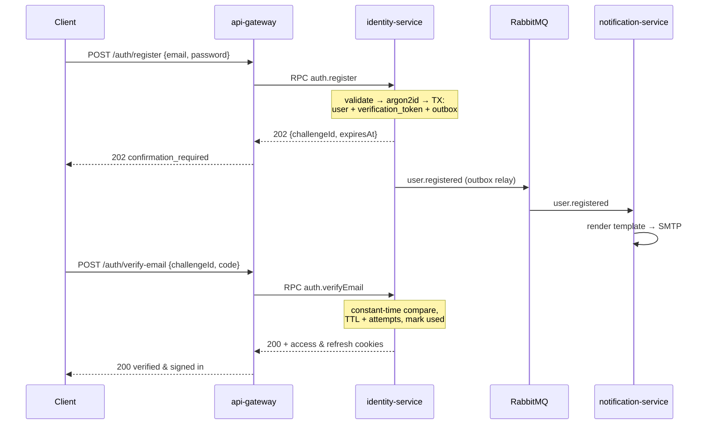

# File Converter — Registration

**Status:** implemented — see §13 for where the code lives and where it refines this design
**Date:** 2026-09-18
**Owning service:** `identity-service`, exposed through `api-gateway` ([ARCHITECTURE.md §2](ARCHITECTURE.md#2-service-decomposition))
**Related:** [ARCHITECTURE.md](ARCHITECTURE.md) · [NON-FUNCTIONAL-REQUIREMENTS.md](NON-FUNCTIONAL-REQUIREMENTS.md)

---

## 1. Scope

Create a user account from an email and a password, optionally gated behind email confirmation.

**Actor:** guest (unauthenticated).

**In scope:** `POST /auth/register`, `POST /auth/verify-email`, `POST /auth/resend-verification`, the
verification token lifecycle, and the cleanup of accounts that are never confirmed.

**Out of scope here:** login, refresh rotation and password reset — they share the confirmation
mechanism described in §5 but have their own flows and documents.

---

## 2. Configuration flags

Email confirmation is switchable **per scenario**, independently:

| Flag | Scenario | Default |
|---|---|---|
| `AUTH_CONFIRM_REGISTRATION` | this document | `true` |
| `AUTH_CONFIRM_PASSWORD_RESET` | password reset | `true` |
| `AUTH_CONFIRM_LOGIN` | login (email as a second factor) | `false` |
| `AUTH_CONFIRM_METHOD` | `otp` \| `link` — how the confirmation is delivered | `otp` |

**Where they live.** For the MVP these are env vars validated by the existing Joi schema
([config.validation.ts](../libs/core/src/config/config.validation.ts)) — zero new machinery, and the whole
config surface stays in one place. The requirement says *the administrator* toggles them, which strictly
means a runtime switch and therefore a `settings` table plus an admin endpoint; that only makes sense
once an admin surface exists at all (open question 6 in [ARCHITECTURE.md](ARCHITECTURE.md#14-open-questions)).

**Recommendation:** env-only now, behind a `SettingsService` interface so that swapping the source for a
cached DB table later changes one provider and no call sites. Reading the flag through a service from day
one is what makes that swap free.

---

## 3. User stories

1. **Confirmation off.** The guest submits email + password, the account is created and active, and they
   are logged in immediately.
2. **Confirmation on.** The guest submits email + password, the account is created but unverified, a code
   or link is emailed, and only after confirming can they log in.

---

## 4. `POST /auth/register`

### 4.1 Request

```jsonc
{
  "email": "user@example.com",
  "password": "correct horse battery staple"
}
```

Validated by a `class-validator` DTO ([NFR §4](NON-FUNCTIONAL-REQUIREMENTS.md#4-input-validation)):

| Field | Rules |
|---|---|
| `email` | required, `@IsEmail()`, max 254, **normalised**: trimmed and lower-cased before any lookup or storage |
| `password` | required, `@IsString()`, min 12, max 128, not in a common-password deny-list |

**Password policy.** Length over composition: 12 characters minimum, no forced
upper/lower/digit/special mix, and a check against a bundled list of the most common passwords. Forced
composition rules push people toward `Password1!` — predictable to an attacker and annoying to everyone
else, while length is the property that actually costs an attacker work. The maximum matters too: it
bounds the work `argon2id` does per request, so a 1 MB password cannot become a denial-of-service vector.

Email is normalised before the uniqueness check, otherwise `User@x.com` and `user@x.com` are two accounts;
the column is `CITEXT` with a unique index ([ARCHITECTURE.md §7](ARCHITECTURE.md#7-data-model)) so the
database enforces this even if a code path forgets.

### 4.2 Logic

1. Validate the DTO; reject early on format or policy failure.
2. Normalise the email.
3. Hash the password with **argon2id** — never store or log the plaintext (§9).
4. Inside one `@Transactional()` ([NFR §1.3](NON-FUNCTIONAL-REQUIREMENTS.md#13-transactions)):
   - insert `users` with `email_verified_at = NULL`;
   - if confirmation is **on**: insert a `verification_tokens` row (`type = 'email_verification'`,
     hash only, `expires_at`);
   - insert the **outbox** row carrying `user.registered`.
5. Commit. The outbox relay publishes `user.registered`; `notification-service` renders and sends the mail.
6. If confirmation is **off**, mark `email_verified_at = now()` in the same transaction and issue tokens.

**Why a real user row and not a separate `pending_registrations` table.** The architecture's data model
already carries `users.email_verified_at` and a generic `verification_tokens` table, and a second table
holding unconfirmed emails would have to race the first one for uniqueness — two places that can both
claim `user@example.com`, with no database constraint able to stop it. One row, one unique index, one
truth. The cost is unverified rows accumulating, which §7 handles.

The mail is sent **only through the outbox**, never inline in the request. An SMTP call inside the
transaction holds a database connection on a slow network operation and cannot be rolled back — the
failure mode is a user who exists and never gets a letter, or a letter about a user who was rolled back.

### 4.3 Responses

**A — confirmation off:** `201 Created`, with the session in two httpOnly cookies — `access_token` and
`refresh_token` ([AUTHORIZATION.md §3](AUTHORIZATION.md#3-cookies-and-what-a-request-looks-like)).
Neither token appears in the body.

```jsonc
{ "status": "registered", "userId": "...", "accessTokenExpiresAt": "..." }
```

**B — confirmation on:** `202 Accepted`, no tokens.

```jsonc
{ "status": "confirmation_required", "method": "otp", "challengeId": "...", "expiresAt": "..." }
```

`challengeId` is an opaque, non-guessable reference to the verification attempt. The client sends it back
with the code, so the confirmation request does not have to carry the email again and cannot be used to
probe for other accounts.

---

## 5. Confirmation

Runs **only** when `AUTH_CONFIRM_REGISTRATION` is on. Both methods write the same
`verification_tokens` row and differ only in what is emailed and how it comes back.

### 5.1 OTP — `AUTH_CONFIRM_METHOD=otp`

| Parameter | Value |
|---|---|
| Format | 6 digits, generated with a CSPRNG (`crypto.randomInt`), never `Math.random` |
| TTL | 10 minutes |
| Entry attempts | 5, then the challenge is burned — a new one must be requested |
| Resend | at most 1 per 60 s, at most 5 per hour per account |
| Storage | **hash only** (SHA-256 is enough for a high-entropy short-lived token), compared in constant time |
| Reuse | single use; `used_at` set on success, and issuing a new code invalidates all previous ones |

A 6-digit code is a million possibilities — trivially brute-forceable without the attempt cap, which is
why the cap is a correctness requirement here and not a nicety. It is enforced **per challenge** in the
database, not by the IP throttler, since an attacker rotating IPs would otherwise get unlimited guesses.

`POST /auth/verify-email` → `{ "challengeId": "...", "code": "123456" }`

### 5.2 Magic link — `AUTH_CONFIRM_METHOD=link`

| Parameter | Value |
|---|---|
| Format | 32 random bytes, base64url — 256 bits, so no attempt cap is needed |
| TTL | 24 hours (configurable) |
| Delivery | `https://<app>/verify-email?token=...` |
| Storage | hash only, single use |

The link's TTL is longer than the OTP's on purpose: a code is typed from an open mailbox within minutes,
whereas a link is often clicked hours later, and the token's entropy — not its lifetime — is what
protects it. The token travels in a URL, so it will land in browser history and possibly a referrer
header; single use plus the verification-only scope keeps that exposure cheap.

The frontend posts the token to the same endpoint: `POST /auth/verify-email` → `{ "token": "..." }`.

### 5.3 On success

Set `email_verified_at = now()`, mark the token used, publish `user.email_verified`, and issue tokens —
the user is logged in and does not have to type the password again.

### 5.4 Resend — `POST /auth/resend-verification`

Takes `challengeId` (or the email), applies the resend limits from §5.1, invalidates the previous
token, and always answers `202` with a neutral body regardless of whether the account exists or is
already verified.

**A resend rotates the secret inside the existing challenge** rather than opening a new one, so the
`challengeId` the client received at registration stays valid and the response can stay genuinely
neutral — a new handle would have to be returned, and returning one for an address that has no
account is exactly the leak this endpoint is meant to avoid. A unique partial index on
`(user_id, type) WHERE used_at IS NULL` makes "at most one live challenge" a database guarantee
rather than a convention.

Rotating resets `attempts`, which is safe because the resend limits bound the total: 5 resends an
hour × 5 guesses each is 25 attempts against a one-in-a-million code.

---

## 6. Flows



With confirmation off the flow collapses to the first exchange, returning `201` and tokens.

---

## 7. Data model

Uses the tables already in [ARCHITECTURE.md §7](ARCHITECTURE.md#7-data-model); registration needs no new
ones. They live in [schema.prisma](../apps/identity-service/prisma/schema.prisma):

- `users` — `email CITEXT UNIQUE`, `password_hash`, `role`, `email_verified_at`, timestamps.
- `verification_tokens` — `user_id`, `type`, `token_hash`, `expires_at`, `used_at`, plus `attempts` and a
  `challenge_id` for the OTP flow.

**Cleanup.** A scheduled job deletes users with `email_verified_at IS NULL` older than 7 days along with
their tokens, and expired tokens for verified users daily. Without it, a typo'd address holds an email
hostage forever and the table fills with abandoned rows. The 7-day window is long enough that a user who
confirms late is not surprised, and re-registering on a freed email is then a clean path rather than a
`409` no one can resolve.

---

## 8. Errors

One envelope (`code`, `message`, `details`, `correlationId`) from the global exception filter, so clients
branch on a stable `code`:

| HTTP | `code` | When |
|---|---|---|
| 400 | `VALIDATION_FAILED` | email format, missing field, password too short/long |
| 400 | `PASSWORD_TOO_WEAK` | fails the deny-list check |
| 409 | `EMAIL_ALREADY_REGISTERED` | duplicate email — see the note below |
| 400 | `CONFIRMATION_INVALID` | wrong code or unknown/used token |
| 410 | `CONFIRMATION_EXPIRED` | past `expires_at` |
| 429 | `CONFIRMATION_ATTEMPTS_EXCEEDED` | more than 5 wrong codes on one challenge |
| 429 | `RESEND_TOO_SOON` | resend inside the 60 s window, `Retry-After` set |
| 429 | `RATE_LIMITED` | the IP/email throttle from [NFR §3](NON-FUNCTIONAL-REQUIREMENTS.md#3-rate-limiting) |

**On email enumeration.** Hiding whether an address is registered is only achievable when confirmation is
**on**: the endpoint then answers `202` identically in both cases, and the existing account is told by
email that someone tried to register with their address. Concretely, an occupied address takes one of
two paths, and neither is distinguishable from a free one by the caller:

| Existing account | What happens | What the caller gets |
|---|---|---|
| unverified | its challenge is rotated and a fresh code mailed — the ordinary "I lost the first mail" case | the real `challengeId` |
| verified | `user.registration_attempted` is published and the owner gets a notice; no account is touched | a `challengeId` matching no row, against which any code fails as a wrong code would |

Hitting the 60-second resend cooldown on the first path is swallowed rather than returned: surfacing
it would turn the refusal itself into proof that the address exists.

With confirmation **off** the response must
differ — the caller either gets a session or does not — so a plain `409` is the honest answer, and the
registration throttle is what makes enumeration expensive rather than impossible. Documenting which mode
gives which guarantee is the point; pretending both are equally private is not.

A duplicate must also be caught by the unique index, not only by a pre-check: two concurrent requests
both pass a `SELECT` before either inserts. The `23505` violation is translated into the same `409`.

---

## 9. Logging and audit

Per [NFR §6](NON-FUNCTIONAL-REQUIREMENTS.md#6-logging-of-critical-events), every line carries
`correlationId` and, once known, `userId`:

| Event | Level | Notes |
|---|---|---|
| `auth.register.attempt` / `.success` / `.rejected` | info / warn | rejection reason as a code, never the password |
| `auth.register.duplicate_email` | warn | a burst is an enumeration probe |
| `auth.verification.sent` / `.resent` | info | method (`otp`/`link`), never the code or token |
| `auth.verification.success` | info | |
| `auth.verification.failed` | warn | reason: invalid / expired / attempts exceeded |
| `auth.verification.cleanup` | info | how many unverified accounts were removed |

**Never logged:** the password, the password hash, the OTP, the raw or hashed token, the verification
link. Redaction lives in the pino serialiser so it holds even when someone logs a whole DTO. Email
addresses are masked in production logs.

---

## 10. Security and rate limiting

- **Password storage:** `argon2id`, memory-hard, with parameters tuned so one hash costs ~100 ms on the
  target hardware (start from `m=19 MiB, t=2, p=1` and measure). Each hash gets its own salt, handled by
  the library. Parameters are stored with the hash, so they can be raised later and rehashed on next
  login without invalidating anyone.
- **Rate limits** (the registration rows of [NFR §3](NON-FUNCTIONAL-REQUIREMENTS.md#3-rate-limiting)):
  `POST /auth/register` 5/hour per IP and 3/hour per email; `resend-verification` 1/60 s and 5/hour per
  account; `verify-email` 10/hour per IP on top of the 5-attempt cap per challenge. These protect a real
  cost — every registration sends an email, and an open registration endpoint is a free spam relay that
  will get the sending domain blacklisted.
- The response time of `POST /auth/register` should not depend on whether the email exists — do the
  password hashing either way rather than short-circuiting on the duplicate check.
- All of this sits behind the CORS allow-list and the validation rules of
  [NFR §4–5](NON-FUNCTIONAL-REQUIREMENTS.md#4-input-validation).

---

## 11. Acceptance

- Registering with confirmation off returns `201` and a working session; with it on, `202` and login is
  refused until the email is confirmed.
- A second registration on the same email fails with `409` even when both requests arrive simultaneously.
- An OTP is unusable after 10 minutes, after 5 wrong attempts, and after being used once.
- Requesting a new code invalidates the previous one.
- No log line in any service contains a password, a code or a token.
- The unverified-account cleanup frees the email for re-registration.
- Covered by unit tests on the service, integration tests against Postgres for the transaction and the
  unique constraint, and one e2e test walking register → verify → login
  ([NFR §7](NON-FUNCTIONAL-REQUIREMENTS.md#7-test-coverage--80)).

---

## 12. Resources and decisions to confirm

**JWT.** Access token 15 min, `HS256` with a secret from env (or `RS256` if other services must verify
locally without calling identity). Payload carries `sub`, `roles`, `jti`, `exp` — no email, no personal
data, since a JWT is signed but not secret.

*Superseded:* this section originally specified an opaque refresh token, stored hashed, with reuse
detection revoking the whole family. [AUTHORIZATION.md §1](AUTHORIZATION.md) forbids storing refresh
state at all, so the refresh token is now a second JWT and there is nothing left to detect reuse
against.

**Password storage.** `argon2id` via the `argon2` package (§10). Not bcrypt: its 72-byte input limit is a
silent truncation trap, and it is not memory-hard, which is exactly what GPU cracking exploits.

**Email.** Sent only by `notification-service`, driven by outbox-published events, with Mailhog locally
and turboSMTP in production ([ARCHITECTURE.md §12](ARCHITECTURE.md#12-local-stack)). Templates are
versioned with the service; each send is idempotent on `(user_id, type, ref_id)` so a redelivered message
does not send a second letter.

---

## 13. Where the code lives

| Concern | File |
|---|---|
| Flags, behind the swappable interface of §2 | [auth-settings.service.ts](../apps/identity-service/src/modules/auth/auth-settings.service.ts) |
| Register / verify / resend | [auth.service.ts](../apps/identity-service/src/modules/auth/auth.service.ts) |
| Challenge lifecycle, §5 | [verification.service.ts](../apps/identity-service/src/modules/auth/verification.service.ts) |
| argon2id and the password policy, §4.1 | [password.service.ts](../apps/identity-service/src/modules/auth/password.service.ts) |
| Access + refresh tokens, §12 | [tokens.service.ts](../apps/identity-service/src/modules/tokens/tokens.service.ts) |
| Outbox and its relay, §4.2 | [modules/outbox/](../apps/identity-service/src/modules/outbox/) |
| Cleanup, §7 | [verification-cleanup.job.ts](../apps/identity-service/src/modules/auth/verification-cleanup.job.ts) |
| Schema, §7 | [schema.prisma](../apps/identity-service/prisma/schema.prisma) and its [migration](../apps/identity-service/prisma/migrations/) |
| RPC surface | [auth.controller.ts](../apps/identity-service/src/modules/auth/auth.controller.ts) |
| HTTP surface and cookies, §4.3 | [gateway auth.controller.ts](../apps/api-gateway/src/modules/auth/auth.controller.ts) |
| Error envelope, §8 | [libs/core/src/errors/](../libs/core/src/errors/) |
| Per-email rate limit, §10 | [email-rate-limit.guard.ts](../apps/api-gateway/src/modules/auth/email-rate-limit.guard.ts) |

Two events were added beyond those the architecture listed, both consumed by
`notification-service`: `user.verification_resent` and `user.registration_attempted` (§8).

Login is [AUTHENTICATION.md](AUTHENTICATION.md); sessions, refresh and logout are
[AUTHORIZATION.md](AUTHORIZATION.md).

**Not yet built:** password reset, which is why `AUTH_CONFIRM_PASSWORD_RESET` is read by the settings
service but not acted on. The mail templates themselves belong to `notification-service` and are still
to come — identity publishes the events, nothing consumes them yet.

**Still to confirm with the mentor:**

1. Is a confirmed email a precondition for converting files, or only for logging in? (Open question 5 in
   [ARCHITECTURE.md](ARCHITECTURE.md#14-open-questions).)
2. Should registration auto-login when confirmation is off, as proposed in §4.3?
3. Are the flags env-level for the MVP (§2), or is an admin settings surface expected immediately?
4. Is the 7-day unverified-account retention (§7) acceptable?
